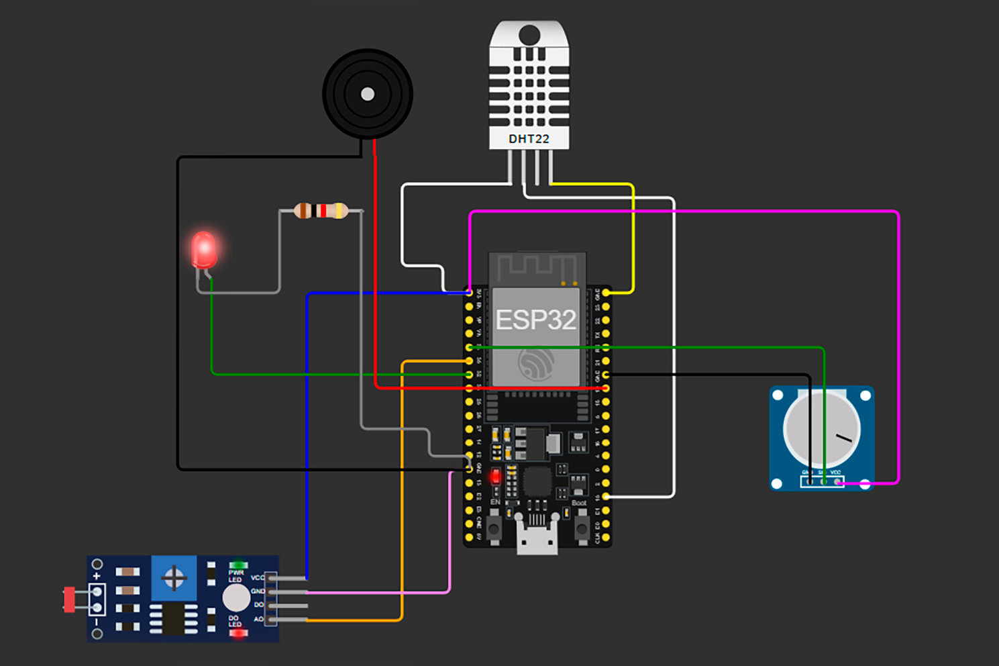
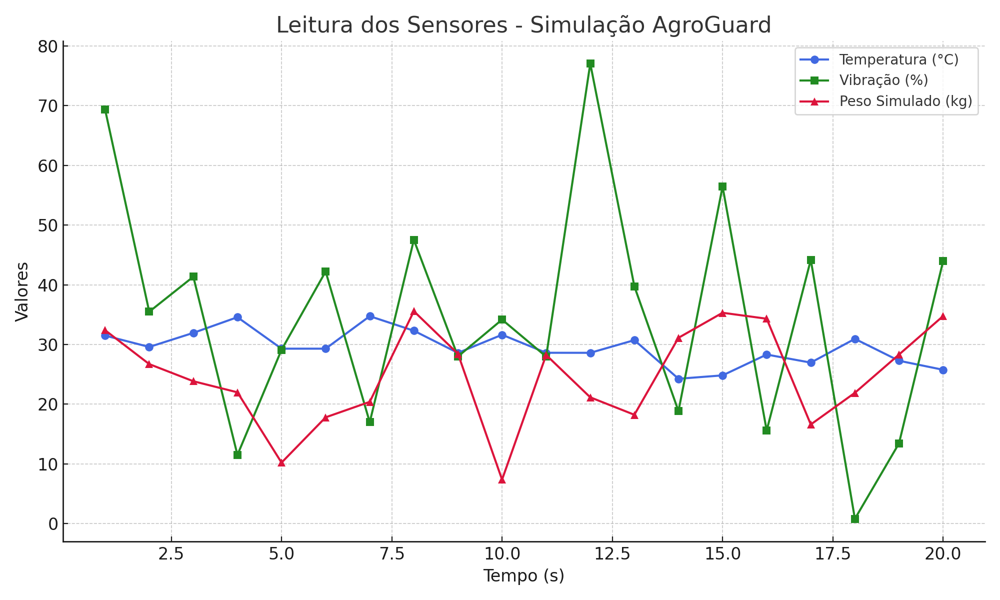

# Enterprise Challenge – Sprint 2 – Reply

## Continuidade da Sprint 1
Esta entrega dá continuidade ao projeto **AgroGuard**, iniciado na Sprint 1, com foco na antecipação de falhas em equipamentos de linha de produção agroindustrial (esteiras, seladoras e sensores de peso). Após termos definido a arquitetura digital, nesta fase evoluímos para a **simulação prática da coleta de dados em tempo real**, validando parte operacional do sistema.

---

## Objetivo da Sprint 2
Simular um circuito funcional com **ESP32 e sensores virtuais** que representem situações reais de falha em equipamentos agroindustriais. A coleta e leitura dos dados permitirá realizar uma primeira análise exploratória do processo, reforçando a base para futuras aplicações preditivas com IA dentro do sistema AgroGuard.

---

## Sensores Utilizados e Justificativas

| Equipamento | Sensor Simulado | Finalidade |
|------------|------------------|------------|
| **Seladora** | DHT22 (Temperatura/Umidade) | Detectar superaquecimento durante operação |
| **Esteira transportadora** | Potenciômetro (Vibração) | Monitorar oscilações anormais que indiquem falha mecânica |
| **Sensor de peso** | LDR (simula ruído/luminosidade) | Simular falha na leitura de peso em embalagem |

---

## Montagem do Circuito
- A montagem foi feita na plataforma **Wokwi** com ESP32.
- Cada sensor foi configurado para simular os comportamentos esperados.
- A leitura dos dados é exibida via `Serial.println()`.

> 

---

## Trecho do Código ESP32

```cpp
#include <DHT.h>

#define DHTPIN 15
#define DHTTYPE DHT22
DHT dht(DHTPIN, DHTTYPE);

const int vibPin = 34;    // Potenciômetro
const int pesoPin = 35;   // LDR

void setup() {
  Serial.begin(115200);
  dht.begin();
}

void loop() {
  float temp = dht.readTemperature();
  float umid = dht.readHumidity();
  int vibracao = analogRead(vibPin);
  float vib = map(vibracao, 0, 4095, 0, 100);
  int pesoBruto = analogRead(pesoPin);
  float pesoSimulado = map(pesoBruto, 0, 4095, 0, 50);

  Serial.print("Temperatura (C): "); Serial.print(temp);
  Serial.print(" | Umidade (%): "); Serial.print(umid);
  Serial.print(" | Vibração (%): "); Serial.print(vib);
  Serial.print(" | Peso (kg): "); Serial.println(pesoSimulado);

  delay(2000);
}
```

## Dados Coletados e Gráfico
- Foram realizadas 20 simulações de leitura.
- Os dados foram salvos em `.csv` e representados graficamente.

> 

### Insight Inicial:
Durante o monitoramento, foi observado que altos níveis de **vibração coincidem com aumentos de temperatura**, indicando risco de superaquecimento da seladora. Essa correlação reforça a importância de múltiplos sensores e pode alimentar futuros modelos preditivos do AgroGuard.

> ⚠️ Os dados coletados nesta simulação serão utilizados nas próximas etapas do projeto para treinar modelos de Machine Learning, permitindo que o AgroGuard antecipe falhas com maior precisão.

---

## Estrutura do Repositório (Sprint 2)
```
enterprise-challenge/
├── sprint2/
│   ├── docs/
│   │   └── print_circuito.png
│   ├── code/
│   │   └── agroguard_esp32.ino
│   ├── data/
│   │   └── dados_coletados.csv
│   ├── grafico/
│   │   └── analise_inicial.png
│   └── README.md
```

---

## Conclusão
A Sprint 2 representa uma evolução concreta do AgroGuard, saindo do planejamento para uma **simulação realista da coleta de dados**. Esses dados alimentam a etapa futura de análise preditiva com IA, permitindo antecipação de falhas e maior segurança no processo industrial agroalimentar.

> *Próximo passo: integrar esse sistema a modelos de IA e visualização em dashboards.*

# AgroGuard ESP32 — Sistema de Monitoramento Agrícola com Alertas

Projeto desenvolvido para monitoramento de temperatura, umidade, vibração e peso simulado em ambientes agrícolas, utilizando ESP32, sensores e alertas visuais e sonoros.

## Visão Geral

O sistema é composto por:
- Sensor DHT22 para leitura de temperatura e umidade
- Potenciômetro simulando vibração de esteira
- Fotoresistor simulando sensor de peso
- LED para alerta visual
- Buzzer para alerta sonoro

Quando a temperatura ultrapassa 30 °C ou a vibração atinge mais de 70%, o sistema ativa o LED e o buzzer como forma de sinalização imediata.

---

## Componentes Utilizados

| Componente        | Descrição                                |
|-------------------|-------------------------------------------|
| ESP32             | Microcontrolador principal                |
| DHT22             | Sensor de temperatura e umidade           |
| Potenciômetro     | Simula vibração mecânica                  |
| Fotoresistor (LDR)| Simula sensor de peso                     |
| LED vermelho      | Alerta visual                             |
| Buzzer            | Alerta sonoro                             |
| Resistor 1kΩ      | Ligado ao LED para limitar corrente       |

---

## Conexões dos Componentes

| Componente   | Pino ESP32 |
|--------------|------------|
| DHT22 (DATA) | 15         |
| Potenciômetro (SIG) | 34  |
| Fotoresistor (AO) | 35    |
| LED (ânodo)  | 32         |
| Resistor do LED (cátodo ao GND) | - |
| Buzzer       | 19         |

---

## Bibliotecas Utilizadas

As bibliotecas são automaticamente reconhecidas pelo Wokwi com base nos includes do código. No projeto, a seguinte biblioteca foi utilizada com sucesso:

Wokwi Library List
See https://docs.wokwi.com/guides/libraries
Automatically added based on includes:
DHT sensor library

---

## Condições de Alerta

| Parâmetro     | Condição               | Ação Tomada                        |
|---------------|------------------------|------------------------------------|
| Temperatura   | Acima de 30 °C         | LED acende e buzzer toca           |
| Vibração      | Acima de 70%           | LED acende e buzzer toca           |
| Peso Simulado | Apenas monitoramento   | Nenhum alerta                      |

---

## Observações

- O projeto foi desenvolvido e testado no [Wokwi](https://wokwi.com/) com sucesso.
- Os sensores simulados permitem testes em tempo real.
- O buzzer gera um som contínuo simples (simulado no Wokwi).

---

## Estrutura de Arquivos

```
📦 agroguard_esp32
├── agroguard_esp32.ino     # Código-fonte principal
├── diagram.json            # Esquema eletrônico do Wokwi
├── libraries.txt           # Bibliotecas necessárias
└── README.md               # Documentação do projeto
```

### Simulação Online

Veja o AgroGuard em funcionamento no Wokwi:  
>> [Acesse a simulação no Wokwi](https://wokwi.com/projects/433340210648456193)